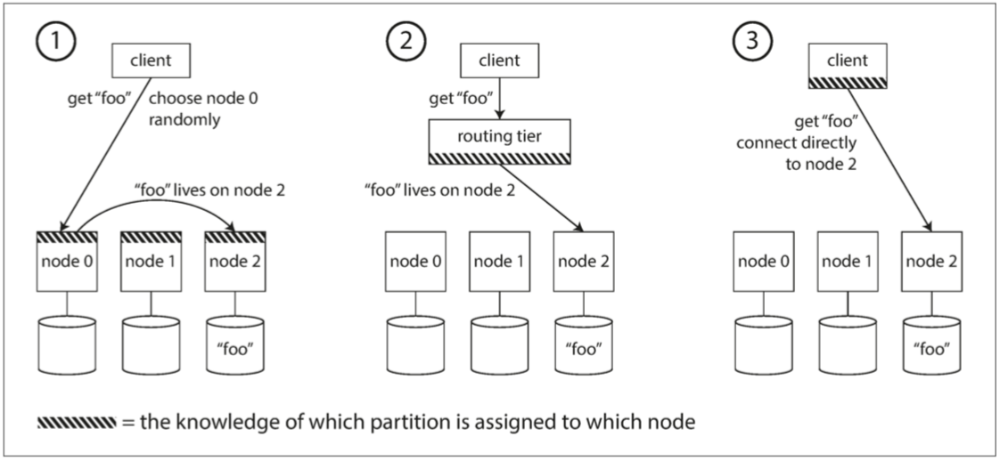

## 数据系统

### 1. 可靠性, 伸缩性, 可维护性

1. 可靠性 Reliability - 容错, 减少整体失效

2. 可伸缩性 Scalability
   - 描述负载(write/read, 峰值)和性能(延迟,吞吐).

3. 可维护性 Maintainability: 
   - 易操作, 系统简单, 可演化.

### 2. 数据模型与查询语言

**层次模型:** 树状结构, 每个记录有一个父节点.

**网络模型:** 树状结构, 每个记录有n(1+)个父节点.

**关系模型:** 把所有数据平铺开, 使用对应关系关联起来, 使用索引快查. **支持多对一和多对多.**

**文档模型:** 还原成层次模型, 在父记录中存储嵌套记录. **架构灵活, 更好性能.**

- 关系模型RDBMS, NoSQL使用json存储, 是一种文档模型
- **有助于简化应用的数据模型**
  - 数据类似文档模型(一对多关系树) 的应用用文档模型.
  - 设计多对多关系, 高度关联的数据, 应该用关系模型. 

- 文档模式: schema-on-read, 关系模型: schema-on-write.
- 文档模式的性能好, 在于需要文档的大部分内容, 如果只要一点, 可能更坏.
- 文档模型和关系数据库结合是一种方案.

### 3. 存储与检索 

log-structured, page-oriented 两个存储引擎.

- 数据结构驱动数据库的get和set性能更快. 索引让查询更高效

1. log-structured: hash存储
2. log-structured: SSTable存储+LSM思想
3. page-oriented: Tree存储

**内存数据库相对磁盘数据库更快的原因在于省去了将内存数据结构编码为磁盘数据结构的开销。**

- 事务处理还是分析: OLAP数据分析需要大量的数据查询. 和OLTP事务处理不太相同, 催生数据仓库.

- 数据仓库: 从OLTP事务数据库里面经过ETL(抽取-转换-加载)存入仓库.

  数据模型通常是关系型, 因为SQL是和分析查询. 针对不同查询模式做优化. 

- 数据分析模式: 星型: 中间是核心表, 无数外键连接到他具体的表. 雪花型: 具体的表的键也是外键.

- **列存储:** 数据仓库的中心表, 常常100+列, 查询只需要几列, 所以修改为按列存储和压缩.

### 4. 编码与演化

关系模型通常用的schema-on-write模式的数据格式要做到

1. 编码数据格式: 数据在内存里是放在对象里, 写入文件/网络里要进行编码/序列化. 
   - 语言特定格式: java的serializable序列化->与java深度绑定, 为了恢复对象要实例化任意类, 带来安全问题. 效率低.
   - JSON/XML: 文本可读, 简单. 但是数值歧义不支持二进制.
   - 直接二进制编码: json的二进制编码节省空间不大, 因为json已经很简单了.
   - Thrift和ProtocolBuffers
   - Avro: 前后兼容很好, 然后压缩率很高.

2. 数据流类型: 
   1. 数据库交流: 
   2. 服务调用: RPC/Rest
   3. 异步消息: MQ

## 分布式数据

单机限制, 要承受更多的数据就要考虑分布式数据存储(无共享架构).

### 5. 复制

复制数据的困难在与处理数据的变更.

1. **三种处理复制数据变更的算法:** single-leader, multi-leader和leaderless. 
2. 复制的权衡: 同步异步, 失败副本...

- **故障切换:** 
  - 脑裂问题
  - 数据重复问题: github的事故: mysql从库提升到master, 因为从库id落后, 分配了一部分之前主库分配的id, 这部分id在Redis中有, 导致一些数据泄露.

3. **主从复制日志的实现:**

   - 基于语句复制: 复制SQL, 但是非确定函数基于不同副本会出现不同结果.
   - 传输预写日志(WriteAheadLog):
   - 逻辑日志(基于行): mysql的binlog.

4. **复制延迟问题-如何处理最终一致性**

   

### 6. 分区Partition

1. 分区与复制

   1. 键值数据的分区: 

      - 简单范围分区: 没有解决热点数据. 数据可能不均匀.
      - 键的hash分区: key的顺序被打乱了, 可以用组合索引折中. (userId, order的字段), 按照userID hash就不会破坏第二个字段的有序性.
      - hash再优化: 消除负载倾斜和热点: 在主键的开始或者结尾加上一个随机数, 然后可以稍微改善一点.

   2. **次级索引如何分区:** 

      - 基于文档的次级索引进行分区-本地索引: 

        每个分区维护自己的次级索引, 仅覆盖自己分区的数据.

      - 基于term的次级索引进行分区-全局索引:

        全部一个字段的次级索引在一台机器上可以查到, 次级索引用异步更新.

2. **分区再平衡-扩容**

   平衡策略: 

   1. **hash % N:** 如果N变动, 需要移动的数据太多了, 所以不如hash范围分区

   2. **固定数量分区:** 每个分区是固定的, 可以扩大, key指向分区也是确定的. 但是节点盛放1-n个分区, 这样只需要分区在节点间分配, 不会有分区数量变化. redis, ES就是这样. 分区数量和集群容量要衡量

   3. **动态分区:** 

      固定分区数量会限制大小, 所以在分区超过配置大小后分裂成2个分区, 就是动态分区(HBase). 如果分区缩小, 也可以合并分区.

   4. **按节点比例分区:** 

      动态分区是在分区内数据增加后分裂, 这个是节点增加后增加分区.

   半自动运维比较好, 有人工参与.

3. **请求路由-服务发现**-client请求数据要连接哪个节点

   有三种方案: node重定向, gateway网关, client维护路由表

   

   

### 7. 事务transaction

2. **弱隔离级别**

   1. readCommitted: 消除脏读

   2. 不可重复读问题: 

      - 快照隔离: 事务内只能读特定时间点的数据.

        快照隔离的原则就是: 读不阻塞写, 写不阻塞读. MVCC事务ID实现.

   3. **防止更新丢失:** 

      readCommitted和快照隔离只解决了只读事务在并发写入时能看到什么.

      - **排他锁实现的原子写**
      - **显式锁For Update**
      - CAS

3. 强隔离界别: 可序列化级别
   1. 二阶段锁: 共享锁和独占锁. 共享锁可多个并发, 独占锁就独占.
   2. 间隙锁: 性能更好, 挂在索引上. 没有命中就退回到表的共享锁上.

................

### 8. 分布式系统的麻烦

1. **故障和部分失效**

   发生error, 宁愿完全崩溃, 而不要返回错误结果.

2. **不可靠的网络:**

   通过网络连接多台机器的分布式系统已经成为构建系统的主要方式.

   处理网络故障通用就是超时, 放弃等待.

3. 不可靠的时钟

   

- **真相由大多数定义**
- 通过锁确定leader.

### 9. 一致性与共识

**构建容错系统最佳实践**: 创建有实质保证的通用抽象, 让应用以来这些保证.
DB事务, 完全可以依靠有事务的DB.

**分布式系统实质保证的通用抽象**: 共识consensus, 所有节点达成一致.

1. 一致性保证, 探索更强一致性.

最终一致性是非常弱的保证, 在边缘情况会暴露. 分布式一致性和事务隔离级别有类似:
分布式一致性在协调多个instance推导Master, 事务隔离级别是避免并发的竞争.

2. 最强一致性: 线性一致性(linearizability)

为客户端提供只有一个instance的假象, 大家看到的都是一样的. client1完成操作后,
其他client看到的都是一样的.

3. 什么使得线性一致性: CAS

4. 线性一致性 和 serializability. 序列化时事务隔离属性, 保证事务的行为.
   线性一致性是读取写入单对象的新鲜度保证, 没有组合.

5. 线性一致性应用:
   1.  leader选举的锁定.
   2.  约束和唯一性保证.
   3.  跨MQ的应用顺序保证: MQ处理的不能比人家前提还要快.

6. CAP定理: 如果应用需要线性一致性, 那么掉线后不能处理请求.
   发生网络故障时，你必须在线性一致性和整体可用性之间做出选择

7. 原子提交与两阶段提交(2PC)
   1. 两阶段提交是跨多节点的原子事务提交算法:
      协调者在写完数据之后用prepare和commit两个阶段来确认数据一致性.
   2. 三阶段提交:
   3. 实践中的分布式事务: 一般用2PC.

## 第三部分: 衍生数据

将多个不同数据系统(可能有着不同数据模型)集成为一个协调一致的应用架构时,
会遇到的问题.

### 10. 批处理

**服务是在线的系统, 批处理系统是离线的job, 流处理系统是准实时的.**

1. 使用Unix工具的批处理: 管道符统计日志文件.

2. Unix设计哲学: 每个程序做好一件事, A的输出是B的输入, 工具减轻编程任务.
3. **如何实现Unit的可组合性:** 
   1. 统一接口
   2. 逻辑和布线分离
4. Unix的局限: 只能在一台机器上.

#### MapReduce和分布式文件系统

1. 批处理工作流的构建:....
2. 批处理workflow的输出:
   - **构建搜索索引** 文档进, 索引出
   - 键值存储

。。。。。。。。。。。。。。。。。。

### 11. 流处理

1. 通过MQ传递事件流: 
2. MQ实现: 基于日志进行MQ存储: kafka
3. 

