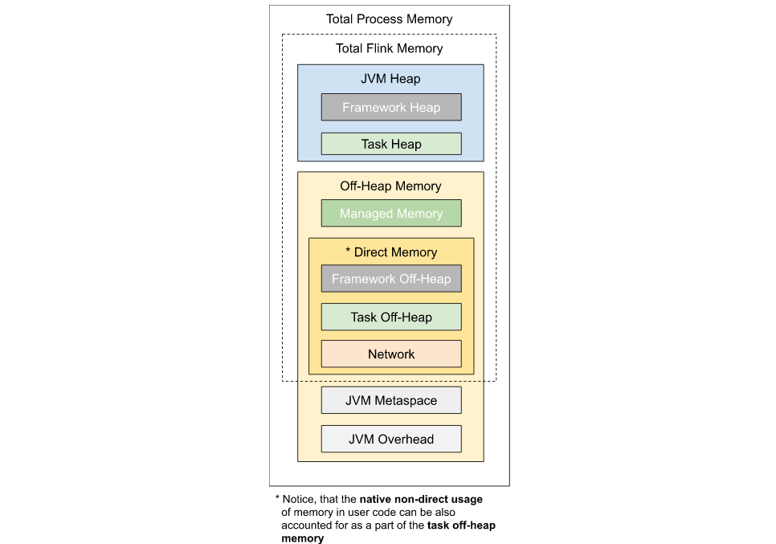

[文章](https://arxiv.org/pdf/1506.08603.pdf)

# Deployment & Operations

## Cluster & Deployment

### 0. Overview

flink有很大的操作空间来决定Flink怎么运行什么时候运行

#### 0.1 Deployment Modes: 

Flink的执行模式有: 不同之处就是cluster的生命周期和资源隔离的保证不同, 然后main方法在client或者在cluster执行
1. session mode
session mode假设已经有一个正在运行的集群, 使用集群的资源来执行提交进来的application. 同一个session cluster里面的应用互相使用和竞争相同的资源. 优点是不用为每个提交的job付出全部的资源. 但是, 一旦一个taskmanager里面的job有错误之后, TaskManager上所有的job都失败了.这个增加了job的风险, 也加重了jobManager的负担. 

2. Per-Job mode
旨在提供更好的资源隔离guarantee, _Per-Job_ 模式使用已有的集群管理框架(比如YARN, K8s)来给每一个提交的job启动一个cluster. cluster只是这一个job用, job完了之后, cluster就被干掉了, 相关的资源也干掉. 这个模式提供了更好的资源隔离, 一个失败的job只能把自己的TaskManager干掉. 将book-keeping的工作分在不同的JobManager上. 生产首选.

3. Application mode
    上面两个模式, application的`main`方法在client上面执行. 在本地执行应用的dependencies 下载. 执行main()方法可以提取出FLink的运行时候的JobGraph 并且把依赖发到cluster. 所以上面两种让client是一个重的资源消耗. 需要贷款去下载依赖和提交到cluster.
    _Application Mode_ 这个mode也为每个提交的application创建一个cluster. 但是main()方法在**JobManager**上运行.  创建的这个cluster可以看成是一个session-cluster, 这个但是只在一个application里面的jobs里面共享, 在application完成后就干掉. 因为这个架构, _application Mode_ 提供了和`Per-Job`模式相同的资源隔离和loadBalance保证, 但是是以整个Application的粒度.  在JobManager运行main()方法节省CPU和贷款. 因为只有一个JobManager, 所以更均匀的分散了下载集群里多个application下载以来的网络负载(((没理解这个, 原来的负载是放在taskmanager上面么?)

  相比`Per-Job`模式, `Application`模式允许一个application包含多个job. job执行的顺序不受部署模式的影响, 只受job调用的顺序. 调用用`execute()`方法, 是阻塞方法, 这个做完下个才做. 还有`executeAsync()`异步运行. 

  注意: application模式里面多个execute()方法执行不支持High Availability, 只有single-execute()支持HA.

4. Summary

  session模式, cluster的生命周期是所有的job运行的周期.

  per-job模式付出了每个job一个cluster的代价, 但是带来更好的资源隔离保证. 集群的生命周期绑定在了job上.

  application模式为每一个application创建一个sessionCluster, 而且在cluster内部执行application的main()方法.

#### 0.2 Deployment Targets

支持多种部署: `Local, Standalone, Yarn, Mesos, Docker, K8s`.


#### 0.3 供应商解决方案

有很多供应商提供了Flink全方位的管理. 但这些供应商不官方支持. 巴拉巴拉 有Alibaba, Amazon,...


#### 0.4 Deployement Best Practice

1. 怎么在classpath里提供依赖:

   Flink给Flink自己或者用户的application的愿意来提供了几种提供dependencies的方法(比如jar包, 或者static data). 根据部署的模式和目标不同, 但有一些共性: 

   - `lib/folder`下面的文件会被添加到启动Flink的classpath下面. 比较适合放一些libraries比如Hadoop或者不是插件的文件系统. 注意这里面添加的可能会扰乱flink的
   - `plugins/<name>/` 里面的在Flink的runtime被加载, 使用不同的classloaders避免和正在用的发生conflicts. 只有[plugin](https://ci.apache.org/projects/flink/flink-docs-release-1.11/ops/plugins.html)的jar才能放在这里哦

2. 在本地下载Maven依赖:

   如果使用maven依赖开发flink, 可以用pom文件去下载所需的依赖. 

   在运行`mvn package`命令时候在同一个目录下会创建`jar/`包

   

### 1. Local Cluster

#### 1.1 Setup: 下载和启动Flink

Flink运行在Linux和Mac上面, Window可以用`Cygwin or WSL` 运行, 只需要JDK就可以运行

1. 首先下载binary, 然后解压. 

2. `./bin/start-cluster.sh`启动flink.

   打开`localhot:8081`就是dashboard界面. 可以检查log目录下的日志

3. 调用`./bin/stop-cluster.sh`关机.


### 2. Standalone Cluster

这个讲解的是怎么在分布的静态集群上运行FLink

#### 2.1 要求

需要`Unix-like` 的环境, 把cluster由一个masterNode和n个workerNode. 安装JDK, SSH(使用flink脚本管理远程的component). 保证所有的node都有无密码的SSH, 相同的目录结构.

需要`JAVA_HOME`环境变量. 当然也可以在flink-conf.yaml设置`env.java.home`.

#### 2.2 Flink Setup

1. 先下载最新的版本, 放到masterNode里, 解压好.

2. [Configuring Flink](https://ci.apache.org/projects/flink/flink-docs-release-1.11/ops/config.html): 编辑`conf/flink-conf.yaml`文件

   `jobmanager.rpc.address`指向masterNode, 还要定义Flink最大内存, 通过`taskmanager/jobmanager.memory.process.size`之类的配置参数. 都是MB单位. 在各自node里面的配置文件里可以覆写.(???flink不是只放在了Master里面么

   下面的图介绍了设置三个node. 

   

3. 启动Flink

4. 添加JobManager/taskManager到Cluster里.

   可以使用`bin/jobmanager.sh`和`taskmanager.sh`脚本添加JobManager和TaskManager

   ```shell
   bin/jobmanager.sh ((start|start-foreground) [host] [webui-port])|stop|stop-all
   bin/taskmanager.sh start|start-foreground|stop|stop-all
   ```

   

### 3. YARN/Mesos/Docker/K8s


### 4. Hadoop 集成

#### 4.1 提供 Hadoop classes

如果使用Hadoop功能, 需要提供FLink Hadoop类. 

建议的是通过`HADOOP_CLASSPATH`环境变量配置Hadoop的classpath. 


## JobManager High Availability

### Overview

JobManager 负责协调每一个Flink部署, 负责_scheduling_和_resource management_. 

默认的, 每个FlinkCluster有一个JobManager, 这会造成SPOF(*single point of failure*)问题: 如果jobManager挂掉, 不能提交新程序, 运行的程序也会失败. 

我们可以用JobManager的HA来恢复JobManager, 消除SPOF, 可以在standalone或者YARN集群里面配置HA. 

更多HA实现细节可以看[JobManager High Availability](https://cwiki.apache.org/confluence/display/FLINK/JobManager+High+Availability).


### 1. Standalone cluster HA

独立的cluster里面通用的JobManager的HA做法是有一个做leader的JobManager, 然后由多个standby的JobManager等着失败. 能供提供担保, 程序在standby的JobManager上任之后就接着运行. standby的和真正的jobmanager没有区别, 每一个都可以变成master或者standby.


#### Configuration

为了开启JobManager的HA, 必须借助于Zookeeper, 配置ZooKeeper Quorum(仲裁), 设置一个master file里面有所有jobmanager的host和webUI的port.

Flink使用ZK为所有running JobManager进行coordinate. ZK提供高可用的coordination通过leader选举和清凉的state存储. 文章下面有**Flink包含启动一个简单的zk的脚本.** 

1. **Masters File(masters)** `conf/masters`

   在文件里面添加jobmanager的地址:

   ```text
   jobManagerAddress1:webUIPort1
   [...]
   jobManagerAddressX:webUIPortX
   ```

   默认的, jobManager都是随机端口, 可以通过`**high-availability.jobmanager.port**`这个key指定, 50000-50025之间. 

2. **config File(flink-conf.yaml)**

   ```shell
   # 1. 开启HA模式:
   high-availability: zookeeper
   # 2. ZK Quorum(仲裁) 配置zk的地址
   high-availability.zookeeper.quorum: address1:2181[,...],addressX:2181
   # 3. ZooKeeper root: 要制定clusterNodes存放的根目录
   high-availability.zookeeper.path.root: /flink
   # 4. ZK的cluster-id. 这个id的zkNode里面存放着cluster所需要的coordinate 数据
   high-availability.cluster-id: /default_ns # important: customize per cluster
   # 注意: 在YARN的时候不要手动设置这个cluster-id.因为cluster-id会根据applicationID自动生成. 手动指定会覆写.
   # 5. Storage directory(required): Jobmanager的metadata在文件系统里面存着, zk里面存着一个pointer. 在recover的时候要用到. 
   high-availability.storageDir: hdfs:///flink/recovery
   ```

   配置好了之后, 就可以运行了. 会启动一个HA-cluster. zk仲裁必须启动时候调用script保证配置了cluster的rootPath.

3. Example: Standalone Cluster with 2 JobManagers

   ```text
   1. 配置HA模式, 还有zk仲裁的参数在conf/flink-conf.yaml
   high-availability: zookeeper
   high-availability.zookeeper.quorum: localhost:2181
   high-availability.zookeeper.path.root: /flink
   high-availability.cluster-id: /cluster_one # important: customize per cluster
   high-availability.storageDir: hdfs:///flink/recovery
   2. conf/masters文件里把所有准备好的JobManager都配上
   localhost:8081
   localhost:8082
   3. 在conf/zoo.cfg里配置zkserver. 只支持每个机器run一个zkServer
   server.0=localhost:2888:3888
   4. 开启zk仲裁:
   $ bin/start-zookeeper-quorum.sh
   Starting zookeeper daemon on host localhost.
   5. 开启HA-Cluster
   $ bin/start-cluster.sh
   Starting HA cluster with 2 masters and 1 peers in ZooKeeper quorum.
   Starting standalonesession daemon on host localhost.
   Starting standalonesession daemon on host localhost.
   Starting taskexecutor daemon on host localhost.
   6. 关闭ZK仲裁, 关闭HA-Cluster
   $ bin/stop-cluster.sh
   $ bin/stop-zookeeper-quorum.sh
   ```

   

#### YARN Cluster的HA

YARN集群的时候, 不需要运行多个JobManager实例, failure之后就restart就好了. 

1. Configuration: 

   ```shell
   # 1. 最大的Application Master attempts, 配置在`yarn-site.xml`里面
   <property>
     <name>yarn.resourcemanager.am.max-attempts</name>
     <value>4</value>
     <description>
       The maximum number of application master execution attempts.
     </description>
   </property>
   # 2. Application attemps, 配置在`flink-conf.yaml`里面
   yarn.application-attempts: 10
   说明应用会尝试重启9次, 然后才会YARN fail这特application. 
   ... 用的时候再说把
   ```

   

#### Configuring For Zookeeper Security

zk运行在Kerberos里面的secure模式, 可以覆写zk的配置在`flink-conf.yaml`里面

```text
zookeeper.sasl.service-name: zookeeper     # default is "zookeeper". If the ZooKeeper quorum is configured
                                           # with a different service name then it can be supplied here.
zookeeper.sasl.login-context-name: Client  # default is "Client". The value needs to match one of the values
                                           # configured in "security.kerberos.login.contexts".
```


#### Zookeeper Versions

Flink包含着zk client 从3.4到3.5. 3.4在lib下面是默认的, 3.5在opt下面, SSL安全连接. 哪个放在lib下面就用哪个.


#### Bootstrap ZK

如果我们没有运行的zk实例, 可以用Flink内带的文件. `conf/zoo.cfg`里面有zk的配置模板. 可以指定host运行zk

```java
server.1=localhost:2888:3888
# server.2=host:peer-port:leader-port
```

`bin/start-zookeeper-quorum.sh`这个脚本会启动一个zk集群 通过一个Flink的包装. 如果生产实践里, 最好是自己有一个ZK集群.


## State & Fault Tolerance 容错

### Checkpoints

#### Overview

checkpoints通过允许state和从流里面指定的位置恢复, 让application有了failure-free执行的语义, 保证了容错.

#### 保存 checkpoint

checkpoint默认不会保留, 只会用于job的故障恢复. 在job cancell的时候就被干掉了. 当然可以设置保留checkpoint. 在job被canceled的时候就不会清理, 我们也可以从checkpoint里面恢复

```java
CheckpointConfig config = env.getCheckpointConfig();
config.enableExternalizedCheckpoints(ExternalizedCheckpointCleanup.RETAIN_ON_CANCELLATION);
```

1. checkpoint的**Directory Structure**

   通过`state.checkpoints.dir`配置参数可以指定存储地方, 存储的目录大概是:

   ```shell
   # 1. 配置
   state.checkpoints.dir: hdfs:///checkpoints/
   env.setStateBackend(new RocksDBStateBackend("hdfs:///checkpoints-data/"));
   # 2. 目录
   /user-defined-checkpoint-dir
       /{job-id}
           |
           + --shared/	# 这个目录里面多个checkpoint的state
           + --taskowned/  #放jobmanager里面不会drop的state
           + --chk-1/
           + --chk-2/
           + --chk-3/
           ...
   ```

2. **Checkpoint和savepoint的不同:**

   checkpoint使用的是statebackend里面的特殊数据format, 是可增加的

   checkpoint不支持Flink的特殊功能(rescalling之类的(

3. 从保存的checkpoint里面恢复

   ```shell
   $ bin/flink run -s :checkpointMetaDataPath [:runArgs]
   ```

   

#### Unaligned checkpoints

Flink1.11里面可以不对齐做checkpoint了. 不对齐需要包含一些in-flight的data(buffer里面的) 作为checkpoint的state.这就可以允许checkpoint的barrier越过buffer了. 

如果checkpoint时间太长了我们就应该开启这个. 开启了之后checkpoint 时间和latency独立开来. 注意部队其对增加IO压力, 所以需要考虑一下.

这个功能比较新, 然后有一些限制: 

- 从unaligned的checkpoints里面恢复不能rescale. 需要savepoint.savepoint是必须对齐的
- flink不支持冰心的不对齐checkpoint. 但如果更快了, 也不需要并发checkpoint了
- 不对齐的checkpoint默认支持watermark在恢复的时候. 只是implicit(隐含)的

recovery的第一步就开始生成watermark了, 而不是保存最后一个watermark来为了rescaling. 在不对其的checkpoints回复的时候, Flink在恢复了in-flight的数据之后就生成watermarks. 如果我们有对最后一个watermark里的data操作, 会产生比对齐checkpoint更多的结果. 为了保证最后一次watermark的操作, 需要把每一个key-group放在不同的union-state里. 1.11.0里面没实现.

未来Flink会让不对齐的checkpoint变成默认的. 解决了其他的问题之后.


### SavePoints

#### 1. 什么是savepoint, 和checkpoint有什么不同

savepoint是当前执行state的快照, 通过[checkpoint机制](https://ci.apache.org/projects/flink/flink-docs-release-1.11/learn-flink/fault_tolerance.html) 创建. 可以用来重启升级我们的FlinkJob. Savepoint包含两个部分: 在可靠存储里面的很大的二进制文件目录, 还有一个小的元数据文件(包含指针指向文件). 

从概念上讲savepoint和checkpoint不同, **有点类似于DB里面的backup和recoveryLog之间的不同**.  checkpoint的主要目的是在job失败的时候提供recovery机制. checkpoint的生命周期由Flink掌管. checkpoint比较轻量还有快速恢复.  

Savepoint被用户创建掌管和删除. 成本更高. 

除了上面的不同, 现在Checkpoint和savepoint的实现基本使用的相同的code, 相同的类型. 未来可能引入不同. 有一个例外是用RockesDB做checkpoint, 使用RocksDB内部的格式而不是flink的savepoint格式, 这样可以让checkpoint更轻量.

#### 2. 绑定OperatorID

建议调整描述我们的应用通过operatorID. 这些ID就是state的scope.

```java
stream.uid("source-id") // ID for the source operator
```

如果不指定ID就自动生成, 只要ID没变就可以自动的从savepoint恢复. 自动生成的ID依赖于我们的structure, 所以最好手动指定

- Savepoint state

  我们可以把savepoint想象成是一个map, 存折每一个stateful operator的state

  ```text
  Operator ID | State
  ------------+------------------------
  source-id   | State of StatefulSource
  mapper-id   | State of StatefulMapper
  ```

  

#### 3. Operations 操作

我们可以trigger 一个savepoint通过command line client(CLi), 也可以用webUI来做. 


#### 4. FAQ

1. 应该为每个operator都标记ID么: 是的.虽然只有statefulOperator才会做savepoint, 但是Flink内置的operator(windowOpeartor)都是stateful的.
2. 如果添加一个新的stateful的Operator会怎么样: savepoint里面没有她的state, 和stateless的operator一样.
3. 如果删除一个有state的operator会怎么样: 默认会失败. 可以启动命令里添加`--allowNonRestoreState`

4. 如果我reorder stateful的operator怎么办? 标记了ID之后会正常重启. 没有标记, 会自动生成新的ID, 然后就恢复不了了

5. 如果添加或删除或者reorder 没有state的operator怎么办?

   如果标记ID了就正常恢复

   没有标记ID, 就完了, savepoint失效了

6. 如果修改了并行度会怎么恢复?

   1.2之后可以制定新的并行度完美的重启

   小于1.2或者使用了废弃的API, , 要把我们的job和savepoint[迁移](https://ci.apache.org/projects/flink/flink-docs-release-1.11/ops/upgrading.html)到1.2以后才能修改并行度. 

7. 可以自己挪动savepoint文件么?

   不能. 因为元数据file里面的指针会失效. 但是, 可以修改metadataFile里面的指针. 或者可以用`SavepointV2Serializer`做savepoint的读写. 


### State Backends

DataStreamAPI里面的state用不同的形式保管着state

```java
1. windows 需要在state里面存折element指导trigger;
2. 有k-vstate的function存储state;
3. 实现CheckpointFunction的需要容错的数据.
```

stateBackend决定了我们怎么存储和使用state.

#### 1. Available State Backends

有三个stateBackend

- **MemoryStateBackend**

  在JavaHeap里面存着, kvstate和windowOperator存折hashtable, 里面放着Values, triggers之类的.

  到了Checkpoint的时候, statebackend会做state的快照, 然后把它作为checkpoint ACK message的一部分发送给JobManager, **JobManager存着checkpoint** 

  memoryStateBackend可以配置成异步的快照, 强烈推荐. 默认开启. 如果要关闭, 可以实例化一个MemoryStateBackend然后设置成false.

  ```java
  new MemoryStateBackend(MAX_MEM_STATE_SIZE, false);
  ```

  MemoryStateBackend的局限: 

  1. 每个单独的state默认小于5MB
  2. state必须小于akka通讯的栈帧大小
  3. 聚合的state必须小于JobManager内存大小
  
  MemoryStateBackend推荐用于:
  
  1. Local 开发和调试
  2. 只有一点点的state的job.
  3. 还建议把[managed memory](https://ci.apache.org/projects/flink/flink-docs-release-1.11/ops/memory/mem_setup_tm.html#managed-memory) 设成0, 这样就能给自己的代码更多的内存了.
  
- **FsStateBackend**

  用file system的URL配置, 比如"hdfs://namenode:40010/flink/checkpoints"...

  **FsStateBackend在TaskManager的内存里暂存in-flight的数据**, 在checkpoint的时候, 把state的snapshot写道文件系统的文件里. 小的metadata存在JobManager的内存里.

  FsStateBackend默认使用异步snapshots避免写stateCheckpoints的时候阻塞. 可以在实例化`FsStateBackend`关闭这个功能.

  FsStateBackend推荐用于: 

  1. 有很多state或者长时间的Windows的或者大的k-v state的job.
  2. 所有HA的步骤里.
  3. 同样推荐把`managed memory`设置成0.

- **RocksDBStateBackend** 我们现在用的

  RocksDBStateBackend也是使用file system URL进行配置.和上面一样. RocksDB是内嵌的持久化k-v数据库.

  **RocksDBStateBackend在RocksDB 数据库里, 存在Taskmanager的数据目录下**, 在checkpoints的时候, 整个的RocksDB数据库会checkpoint到目录里. 小的元数据还是存在JobManager的内存里

  RocksDB的局限:

  1. RocksDB的JNI api是bytes[]上的, 最大的k-v的大小是2^31个bytes(2GB). 使用merge操作的state(比如ListState)可以超过2^31byte, 但是检索的时候会失败...

  **推荐使用:** 和FsStateBackend一样. 但不要把`managed memory`设置成0, [RocksDB需要](https://ci.apache.org/projects/flink/flink-docs-release-1.11/ops/memory/mem_tuning.html#rocksdb-state-backend).

  注意, state的大小只有disk的容量局限, 所以RocksDB要比FsStateBackend存在内存里要大很多. 但速度会慢一点. 

  **RocksDBBackend是唯一支持增长checkpoint的**[下一小节](https://ci.apache.org/projects/flink/flink-docs-release-1.11/ops/state/large_state_tuning.html)会讲, RocksDB本地的metrics默认是关闭的, 可以[配置](https://ci.apache.org/projects/flink/flink-docs-release-1.11/ops/config.html#rocksdb-native-metrics)开启, 可以按照slot限制rocksDB的内存, 下一小节也会讲.

#### 2. 配置stateBackend

默认的state backend, 是jobmanager, 如果我们想配置及群里所有的job, 就在`flink-conf.yaml`里面配置新的默认state backend, 然后每个job可以自己配置. 

```java
// 1. code配置
StreamExecutionEnvironment env = StreamExecutionEnvironment.getExecutionEnvironment();
env.setStateBackend(new FsStateBackend("hdfs://namenode:40010/flink/checkpoints"));
// 如果用rocksDB要添加依赖, 但如果不在代码里操作, 就不用, 因为RocksDB是Flink里面的一部分.
flink-statebackend-rocksdb_2.11 provided;
// 2. flink-conf.yaml配置
state.backend: filesystem
state.checkpoints.dir: hdfs://namenode:40010/flink/checkpoints
```


#### 3. RocksDB state backend 详情

本小小节描述RocksDB做state backend的细节

1. **增量checkpoints**

   RocksDB支持自增的Checkpoint, 可以极大地减少checkpoint的时间, **自增checkpoint只记录上一次checkpoint以来的变化.** 

   Flink使用了RocksDB内部的压缩机制, 可以自我整合(self-consolidating) over time, 所以**增量checkpoint的历史不会无限增长**, 老的checkpoint最终会包含和修剪(感觉就是merge进去了)

   从增量checkpoint里面回复的时间要长一点.如果网络带宽是瓶颈那么更长了. **如果CPU或者IOPs(吞吐量)是瓶颈, 那么恢复起来会更快一点**, 因为从增量checkpoint里面恢复不需要按照Flink的规范kv snapshot格式重建本地RocksDB表(full checkpoint需要)

   虽然增量checkpoint是使用大state推荐的, 还需要手动的开启这个功能

   ```shell
   1. flink-conf.yaml: state.backend.incremental: true # 开启增量checkpoint.
   2. RocksDBStateBackend backend = new RocksDBStateBackend(checkpointDirURI, true) # 代码里开启也可以.
   ```

2. **Memory 管理**

   Flink旨在管理所有进程的内存总消费来保证TaskManager有很好的内存占用. 这就意味着要在Environment限制之内使用内存, 避免被杀掉. 还要有足够的内存, 不要总刷到disk影响CPU.

   为了实现这个目标, Flink默认的把RocksDB的内存配置成TaskManager的`managed memory`(托管内存)(准确的说是slot的). 这个可以很好的开箱即用体验, 大多数application不需要管理RocksDB配置. 提升内存相关的性能只需要提升`managed memory`就好了.

   用户也可以关闭这个功能, 让RocksDB为每一个ColumnFamily(每个state每个operator)独立分配一块内存. 这给专家用户更好的控制RocksDB, 也意味着需要管理很多内存消费.可以看下一节[大state调整](https://ci.apache.org/projects/flink/flink-docs-release-1.11/ops/state/large_state_tuning.html#tuning-rocksdb-memory)里的调整RocksDBMemory.

   - 为RocksDB准备的`Managed Memory`(托管内存)

     默认开启, 配置的是`state.backend.rocksdb.memory.managed`这个key. Flink不会直接管理RocksDB的native内存分配, 但是会配置RocksDB保证他有足够的内存, 这个是slot level的.

     **Flink利用一个slot实现了一个所有RocksDBinstance用的共享缓存和写buffer管理器,** 来控制所有RocksDB instance的内存使用量. 共享cache为RocksDB使用的主要空间的内存设置上限: block cache, index and bloon filter还有MemTables.

     flink提供了两个参数来控制write path(memTable) 和 read path(index&filter, remaining cache)的划分. 如果我们的RocksDB因为缺少writeBuffer(频繁的flush数据)而性能很差, 可以调整一下互相之间的分配比例:

     ```shell
     1. state.backend.rocksdb.memory.write-buffer-ratio 默认0.5, write bufferManager占50%.
     2. state.backend.rocksdb.memory.high-prio-pool-ratio 默认0.1, 10%的共享的内存块里的内存设置为index&filter的. 建议不要设置成0. 可查看RocksDB的文档. 
     ```

     注意: 
     
   - Timers (Heaps vs. RocksDB)
   
     Timers是用来做定时任务的, 比方说开启一个window或者回调一个ProcessFunction. 在RocksDB backend下, timer默认存在RocksDB里面, 这非常的健壮的方式, 可以存储更多的timers. 但是在RocksDB里面管理timers有一定的代价, 所以Flink提供了把timers存在Heap里的配置. heap-based timmer性能更好.
   
     > 之后不讲配置了, 如果遇到了查一下就好了
   
   - 像上面提到的可以开启RocksDB的本地metrics
   
   - 预先定义的 per-columnFamily Options: 上面说的可以定义每个state在RocksDB里面的存成一个columnFamily, 然后单独去管理.


### 调整checkpoint和大state

本小姐知道怎么配置和调整应用如何使用超大的state

#### 1. overview

大型flink应用如果想要可靠的运行, 必须满足两个条件:

- resources在故障之后还可以追上最新的input数据
- checkpoint必须可靠: 这个就要好的checkpoint性能. 

#### 2. 监控state和checkpoints

在UI的checkpoint部分就可以监控checkpoint行为了. 

checkpoint在扩容的时候需要关注两个参数: 

- checkpoint_start_delay: 延迟, 延迟很高说明系统背压很大.
- 对齐阶段里面data buffer里面的数据量: 对于`exactly-once`Flink在接收多个流的operator上面对齐数据流, 把数据放在buffer里. buffer太高意味着checkpoint的barrier非常不同.

注意: 短时间被压大还好, 但长时间就意味着Flink要付出很多了.


#### 3. 调整Checkpointing

定期会启动checkpoint,但太长时间的话, 下一次checkpoint会等着上一次完成之后再进行.

为了避免checkpoint的这种消耗, 应用可以定义**checkpoint的最小间隔**. 之类的设定.


#### 4. 调整RocksDB

RocksDB的性能根据配置可能很不同, 最好的实践: 

- incremental checkpoint 增长的checkpoint
- timmers设置在JVM heap里
- 调整RocksDB的memory
  - 增大托管内存, 一般管用

#### 5. capacity planning(计划自己的应用资源)

- 看被背压监控, 不要有持续的背压.
- 多给点资源, 提升恢复时间, 更快的追上. 底线就是要满足checkpoint
- 类似于window之类的操作会造成下游的operator在没货的时候没事干, 有活的时候压力大. 要注意. 

#### 6. 压缩

Flink提供了对savepoint和checkpoint的压缩选项. 用的是snappy算法, 以后会支持更多. 

压缩的是key-group的state粒度. 每个key的state独立压缩, 所以可以rescaling

#### 7. Task-Local Recovery

- **动机:** 

  Flink在checkpoint的时候, 每个task产生自己的state的snapshot, 然后把快照写到distribute的存储里. jobManager接收到每个task的ack的存储地址, 然后手机号了之后把它们打包成一个checkpointObj.

  在恢复的时候, JobManager打开最新的checkpointObj 然后发到对应的task上, 然后各自取回自己的state快照.  使用分布存储可以保证容错然后也可以多个node一起用. 但是所有的task必须从remote读还是挺耗宽带的. 大state会很耗时

- **实现:**

  Task-local的state恢复有太长时间的问题, 主要的解决思想是每个task不仅把state写到分布村处理, 还留着第二份拷贝在disk或者是在memory里. 让不是node failure的错误就不用从remote拿了. 

  注意这个需要每个checkpoint需要存储拷贝两份, 依赖于state backend和checkpoint策略有不同实现, 大都是直接拷贝两份在不同的地方就好了. 

  

  - 这两个snapshot的关系: 总会优先考虑第二个snapshot. 最可靠的是第一个. 
  - 只有第一个snapshot ack到jobManager, 第二个是TM自己的, 生命周期也是独立的: 比如说TM掌管3个最近的分布存储里的checkpoint, 但只保留最近TM task-local的checkpoint
  - 先依赖task-local的,再用storage里的, 都不行就用older的
  - 第一份是第二份的超集, 第二份可能copy的时候发生error而不全, 但先用local的state, 缺失的再用remote的.
  - task-local可以和remote的checkpoint不同format. 不一定要bytes的, 可以是memory的objects.
  - task-local的checkpoint生命周期就是task之内的, task没有了里面的local state都没了

- 配置本地recovery

  默认本地恢复是关闭的, 可以打开`state.backend.local-recovery= CheckpointingOptions.LOCAL_RECOVERY`. 要注意 本地恢复还不支持 [unaligned checkpoints](https://ci.apache.org/projects/flink/flink-docs-release-1.11/ops/state/checkpoints.html#unaligned-checkpoints) 

- 不同stateBackends的task-local recovery

  现在task-local recovery只包括keyed的statebackend. 之后会包括其他的state.

  - FsStateBackend: 支持task-local恢复. 放在local文件里.
  - RocksDBStateBackend: 支持. FullCheckpoints的时候state存在本地文件里. incrementalCheckpoints的时候, local-state是建立在RocksDB自己的checkpointing机制.

- 重新分配scheduling(Allocation-preserving scheduling)

  task-local的恢复假定会重分配, 每个task会记住自己之前的分配和request, 在恢复的时候会重启slot. 如果slot没有了, 那么task会重新从resourceManager里申请一个新的slot. 这样, **Flink调度策略为最大数量的task提供了从本地状态恢复的机会**


## Configuration

`conf/flink-conf.yaml`文件里配置一切. 在Flink启动的时候会配置生效. 修改需要重启. 

### Basic Setup

默认的配置支持启动一个单节点的Flink session cluster. 本小节是通用的分布式Flink配置

**Hostnames / Ports**, **Memory**, **Parallelism**, **Checkpointing**, **Web UI**

 巴拉巴拉, 是一些配置参数什么的.


## Memory Configuration

Flink运行在JVM里面, 内存管理就是管理JVM里的内存.

### 1. Set up Flink's Process Memory

Flink对每个组件严格控制内存使用, 所以在JVM里挺有效的工作负荷. 也提供细粒度的配置.

1. 配置总内存

   total process memory 包含JVM heap和off-heap两块内存.

   

   分别配置TM和JM的总内存....

2. 配置JVM参数
3. 封存Fractionated 组件: 设置总内存的上下范围.

### 2. 设置TM的内存

1. 总内存: Heap, **托管内存(Flink管理, 用在RocksDB), 直接内存**, 其他内存会自动调整.

   

2. 配置Heap和托管内存

   总内存指定完, 可以指定Heap和托管内存.

   - task heap memory: 可以保证我们自己代码用的Heap大小.
   - Managed Memory: 是本地内存, 用于RocksDB或者批处理的sort之类操作.

3. 配置off-heap内存(直接的或者本地的)

   自己分配的堆外内存, 应该考虑在这个off-heap内存里.

4. 详情的Memory模型

   


### 3. 设置JM内存

JM包含 Resource Manager, Dispatcher and one JobMaster. 

1. 配置总内存
2. 

### 4. 内存调整Guide

1. standalong模式的配置

   配置总内存不让Flink超过.


### 5. 定位问题

有一些Error的原因: IllegalConfigurationException, OutOfMemory...之类的.


### 6. 迁移Guide

Flink的TM, JM配置在1.10变了很多. 


## 生产准备的checklist

1. 明确最大并行度
2. 每个Operator设置UUID
3. 选择适合的State Backend
4. 配置JM的HA


## Command-Line Interface

Flink的命令行命令. 


## 外部资源框架

除了CPU和内存, 还需要其他的资源, 比如深度学习需要GPU. Flink提供了external resource framework来支持外部资源. 

1. 外部资源框架做什么

   - 设置配置设置资源请求的相关字段
   - 向operator提供使用Resource的信息.

   在用ResourceManagementSystem(K8s, Yarn)部署的时候, 外部资源框架确保pod分配的时候会包含我们要的external resource.

   现在大部分resourceManagement都支持外部资源: K8s支持GPU, FPGA... 

...


## Kerberos 授权 配置

本节介绍Flink 如何在多种部署机制下安全的工作.

#### 1. Objective 目标

flink Kerberos安全框架的主要目标是

- 保证cluster里的job有安全的数据访问(通过connector)
- 认证Zookeeper(如果是SASL)
- 认证Hadoop component(比如HDFS, HBase)

#### 2. Flink Security 怎么工作

按理说, Flink可以使用自带的或者其他的connectors, 可以有任何认证方法(Kerberos, SSL/TLS, 账户密码). 但是Flink仅对Kerberos支持一流的支持. 

支持Kerberos的connector有:

- Kafka (0.9+), HDFS, HBase,  ZooKeeper

内部体系结构基于在启动时安装的安全模块(org.apache.flink.runtime.security.modules.SecurityModule), 在启动时候安装. 

TODO


## SSL Setup


